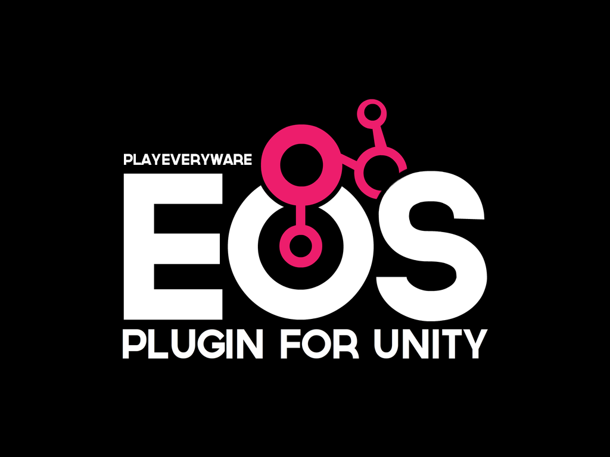

<a href="/readme.md"></a>

<div align="center">  </div>
<br /><br /><br />

---


  Table of Contents
  <ol>
    <li>
      <a href="#overview">Overview</a>
      <ul>
        <li><a href="#supported-platforms">Supported Platforms</a></li>
        <li><a href="#supported-eos-sdk-features">Supported EOS SDK Features</a></li>
      </ul>
    </li>
    <li>
      <a href="#getting-started">Getting Started</a>
      <ul>
        <li><a href="#prerequisites">Prerequisites</a></li>
        <li><a href="#importing-the-plugin">Importing the Plugin</a></li>
        <li><a href="#samples">Samples</a></li>
        <li><a href="#configuring-the-plugin">Configuring the Plugin</a></li>
      </ul>
    </li>
    <li><a href="#plugin-support">Plugin Support</a></li>
    <li><a href="#source-code-contributor-notes">Source Code Contributor Notes</a></li>
    <li><a href="#faq">FAQ</a></li>
  </ol>


# <div align="center">Overview</div> <a name="overview" />
---

The PlayEveryWare EOS Plugin for Unity is a software development kit (SDK) used for integrating EOS into a Unity project. Bringing the free services that connect players across all platforms and all stores, to Unity in an easy to use package. Find more information on EOS [here](https://dev.epicgames.com/en-US/services) and Epic docs [here](https://dev.epicgames.com/docs/epic-online-services).

The [eos_plugin_for_unity repository](https://github.com/PlayEveryWare/eos_plugin_for_unity) contains the source code for development, samples and support for the [PlayEveryWare EOS Plugin for Unity (UPM Package)](https://github.com/PlayEveryWare/eos_plugin_for_unity_upm).

#### Plugin Features: [(In Depth Details)](docs/plugin_advantages.md)

* Social Overlay support across platforms.
* Feature specific sample scenes, that include manager classes for common uses of EOS SDK API.
* Custom Unity Tool for configuring EOS settings and saving to a JSON file.
* Unity editor playback support, handled by reloading EOS SDK.
* Most EOS features are accessible by players without an Epic Games Account.


#### Repo Contents:

* Additional plugin Documentation can be found in the [docs/ directory](docs/).
* A Unity Project for development of feature managers and samples.
* Native Source for ```DynamicLibraryLoaderHelper``` and ```GfxPluginNativeRender```.
* A Tool to build a Unity Package Manager compatible UPM.


#### Plugin Details:

* Targets [Unity 2021.3.8f1](https://unity.com/releases/editor/whats-new/2021.3.8), for best results a version of Unity 2021 is preferred.
* Targets [EOS SDK 1.15.4](https://dev.epicgames.com/docs/epic-online-services/release-notes#1154---2022-nov-16) *(bundled with plugin)*.


<br />

## Supported Platforms

The support level of each target platform in Unity as of the current release of the plugin.

| Supported | Preview | Unsupported at Present |
| - | - | - |
| Unity Editor (No Social Overlay) | [Linux](docs/linux/linux_supported_versions.md) | WebGL |
| Windows Standalone x64 | [MacOS](docs/macOS/macOS_supported_versions.md) | Universal Windows Platform x86 |
| Windows Standalone x86 | Console Platforms | Unity Web Player |
| Universal Windows Platform x64 | | |
| [Android](/docs/android/readme_android.md) (No Social Overlay Yet) | | |
| [iOS](/docs/iOS/readme_iOS.md) (No Social Overlay Yet) | | |
> :heavy_exclamation_mark: Enable `EOS_PREVIEW_PLATFORM` to access Preview platforms.

<br />

## Supported EOS SDK Features

  The EOS Plugin for Unity will be updated over time to support the new content as the EOS SDK continues to release new features and functionality. 

The support level of each EOS SDK features as of the current release of the plugin.

| Supported | | | |
| - | - | - | - |
| [Achievements](https://dev.epicgames.com/docs/game-services/achievements) | [Authentication](https://dev.epicgames.com/docs/epic-account-services/auth-interface) | [Ecommerce](https://dev.epicgames.com/docs/epic-games-store/tech-features-config/ecom) | [Friends](https://dev.epicgames.com/docs/epic-account-services/eos-friends-interface) |
| [Leaderboards](https://dev.epicgames.com/docs/game-services/leaderboards) | [Lobby](https://dev.epicgames.com/docs/game-services/lobbies) | [Lobby with Voice](https://dev.epicgames.com/docs/game-services/voice#voicewithlobbies) | [NAT P2P](https://dev.epicgames.com/docs/game-services/p-2-p) | |
| [Player Data Storage](https://dev.epicgames.com/docs/game-services/player-data-storage) | [Presence](https://dev.epicgames.com/docs/epic-account-services/eos-presence-interface) | [Sessions](https://dev.epicgames.com/docs/game-services/sessions) | [Social Overlay](https://dev.epicgames.com/docs/epic-account-services/social-overlay-overview)/[UI Interface](https://dev.epicgames.com/docs/epic-account-services/eosui-interface) (Not Supported in Editor or Mobile) | |
| [Stats](https://dev.epicgames.com/docs/game-services/eos-stats-interface) | [Title Storage](https://dev.epicgames.com/docs/game-services/title-storage) | [Reports](https://dev.epicgames.com/docs/game-services/reports-interface) | [Sanctions](https://dev.epicgames.com/docs/game-services/sanctions-interface) |
| [Anti-Cheat](https://dev.epicgames.com/docs/game-services/anti-cheat) | [Custom Invites](https://dev.epicgames.com/docs/game-services/custom-invites-interface) | [Metrics](https://dev.epicgames.com/docs/game-services/eos-metrics-interface) | [User Info Interface](https://dev.epicgames.com/docs/epic-account-services/eos-user-info-interface) |
| [Connect Interface](https://dev.epicgames.com/docs/game-services/eos-connect-interface?sessionInvalidated=true) | [Logging Interface](https://dev.epicgames.com/docs/game-services/eos-logging-interface) | [Platform Interface](https://dev.epicgames.com/docs/game-services/eos-platform-interface) |  |


| Unsupported at Present | | |
| - | - | - |
|  [EOS Mod SDK](https://dev.epicgames.com/docs/epic-games-store/tech-features-config/mods) |  [Voice Trusted Server](https://dev.epicgames.com/docs/game-services/voice#voicewithatrustedserverapplication) | [Progression Snapshot Interface](https://dev.epicgames.com/docs/epic-account-services/progression-snapshot) |

<br />

<details>
  <summary><b>The EOS Features Shown by Sample</b></summary>

| Sample Name | EOS Features |
| - | - |
| - All Samples - | [Authentication](https://dev.epicgames.com/docs/epic-account-services/auth-interface), [Social Overlay](https://dev.epicgames.com/docs/epic-account-services/social-overlay-overview),  [User Info Interface](https://dev.epicgames.com/docs/epic-account-services/eos-user-info-interface), <br />[Connect Interface](https://dev.epicgames.com/docs/game-services/eos-connect-interface?sessionInvalidated=true), [Logging Interface](https://dev.epicgames.com/docs/game-services/eos-logging-interface), [Platform Interface](https://dev.epicgames.com/docs/game-services/eos-platform-interface) |
| Achievements | [Achievements](https://dev.epicgames.com/docs/game-services/achievements) |
| Auth & Friends | [Friends](https://dev.epicgames.com/docs/epic-account-services/eos-friends-interface), [Presence](https://dev.epicgames.com/docs/epic-account-services/eos-presence-interface) |
| Custom Invites | [Custom Invites](https://dev.epicgames.com/docs/game-services/custom-invites-interface) |
| Leaderboards | [Leaderboards](https://dev.epicgames.com/docs/game-services/leaderboards), [Stats](https://dev.epicgames.com/docs/game-services/eos-stats-interface) |
| Lobbies | [Anti-Cheat](https://dev.epicgames.com/docs/game-services/anti-cheat), [Lobby](https://dev.epicgames.com/docs/game-services/lobbies), [Lobby with Voice](https://dev.epicgames.com/docs/game-services/voice#voicewithlobbies) |
| Metrics | [Metrics](https://dev.epicgames.com/docs/game-services/eos-metrics-interface) |
| Peer 2 Peer | [NAT P2P](https://dev.epicgames.com/docs/game-services/p-2-p) |
| Performance Stress Test |  |
| Player Data Storage | [Player Data Storage](https://dev.epicgames.com/docs/game-services/player-data-storage)  |
| Player Reports & Sanctions | [Reports](https://dev.epicgames.com/docs/game-services/reports-interface), [Sanctions](https://dev.epicgames.com/docs/game-services/sanctions-interface) |
| Sessions & Matchmaking | [Sessions](https://dev.epicgames.com/docs/game-services/sessions) |
| Store | [Ecommerce](https://dev.epicgames.com/docs/epic-games-store/tech-features-config/ecom) |
| Title Storage | [Title Storage](https://dev.epicgames.com/docs/game-services/title-storage) |
| P2P Netcode | [NAT P2P](https://dev.epicgames.com/docs/game-services/p-2-p) |
| - | - |
| None (Not Supported) | [EOS Mod SDK](https://dev.epicgames.com/docs/epic-games-store/tech-features-config/mods), [Voice Trusted Server](https://dev.epicgames.com/docs/game-services/voice#voicewithatrustedserverapplication), [Progression Snapshot Interface](https://dev.epicgames.com/docs/epic-account-services/progression-snapshot) |
</details>

<details>
  <summary><b>The EOS Features Shown by Requirement of a Player Needing an Epic Games Account</b></summary>
<br />
  
  [EOS Game Services](https://dev.epicgames.com/docs/game-services) can be set up in your game without any requirement for your players to have an Epic Games account. As opposed to [EOS Epic Account Services](https://dev.epicgames.com/docs/epic-account-services), Which will require your players to have an Epic Games account.
  
| Not Required | Required  |
| - | - |
| [Achievements](https://dev.epicgames.com/docs/game-services/achievements) | [Authentication](https://dev.epicgames.com/docs/epic-account-services/auth-interface) |
| [Leaderboards](https://dev.epicgames.com/docs/game-services/leaderboards) | [Ecommerce](https://dev.epicgames.com/docs/epic-games-store/tech-features-config/ecom) |
| [Lobby](https://dev.epicgames.com/docs/game-services/lobbies) | [Friends](https://dev.epicgames.com/docs/epic-account-services/eos-friends-interface) |
| [Lobby with Voice](https://dev.epicgames.com/docs/game-services/voice#voicewithlobbies) | [Presence](https://dev.epicgames.com/docs/epic-account-services/eos-presence-interface) |
| [NAT P2P](https://dev.epicgames.com/docs/game-services/p-2-p) | [Social Overlay](https://dev.epicgames.com/docs/epic-account-services/social-overlay-overview) |
| [Player Data Storage](https://dev.epicgames.com/docs/game-services/player-data-storage) | [User Info Interface](https://dev.epicgames.com/docs/epic-account-services/eos-user-info-interface) |
| [Sessions](https://dev.epicgames.com/docs/game-services/sessions) | [EOS Mod SDK](https://dev.epicgames.com/docs/epic-games-store/tech-features-config/mods) (Unsupported) |
| [Stats](https://dev.epicgames.com/docs/game-services/eos-stats-interface) | [Progression Snapshot Interface](https://dev.epicgames.com/docs/epic-account-services/progression-snapshot) (Unsupported) |
| [Title Storage](https://dev.epicgames.com/docs/game-services/title-storage) |  |
| [Reports](https://dev.epicgames.com/docs/game-services/reports-interface) |  |
| [Sanctions](https://dev.epicgames.com/docs/game-services/sanctions-interface) |  |
| [Anti-Cheat](https://dev.epicgames.com/docs/game-services/anti-cheat) |  |
| [Custom Invites](https://dev.epicgames.com/docs/game-services/custom-invites-interface) |  |
| [Metrics](https://dev.epicgames.com/docs/game-services/eos-metrics-interface) |  |
| [Connect Interface](https://dev.epicgames.com/docs/game-services/eos-connect-interface?sessionInvalidated=true) |  |
| [Logging Interface](https://dev.epicgames.com/docs/game-services/eos-logging-interface) |  |
| [Platform Interface](https://dev.epicgames.com/docs/game-services/eos-platform-interface) |  |
| [Voice Trusted Server](https://dev.epicgames.com/docs/game-services/voice#voicewithatrustedserverapplication) (Unsupported) |  |
</details>

<br />

# <div align="center">Getting Started</div> <a name="getting-started" />
---

## Prerequisites


* An Epic Games Account, you can sign up for [here](https://www.epicgames.com/id/register).
    > :heavy_exclamation_mark: An Epic Games Account is not required by players for [most](#supported-eos-sdk-features) EOS features.
* A product configured on the [Epic Games Developer Portal](https://dev.epicgames.com/portal/).
* A Unity project to integrate the plugin into, it can be a blank project.
    > :heavy_exclamation_mark: Find the plugin's targeted Unity version <a href="#plugin-details">here</a>.
* Minimum <a href="https://docs.unity3d.com/2021.3/Documentation/Manual/system-requirements.html">Unity system requirements</a>.
* Minimum <a href="https://dev.epicgames.com/docs/epic-online-services/eos-get-started/system-requirements">EOS system requirements</a>.

<br />

## Importing the Plugin


There are two options to install the package, from a <a href="#adding-the-package-from-a-tarball">tarball</a> [Quickest to start], or from a <a href="#adding-the-package-from-a-git-url">GIT URL</a> [Quickest for updates].

## Adding the package from a tarball
<br />

1. Download the latest release tarball, ```"com.playeveryware.eos-[version].tgz"``` [here](https://github.com/PlayEveryWare/eos_plugin_for_unity/releases).
    > :heavy_exclamation_mark: If one uses the source download it will be missing all the git-lfs files (i.e. binaries, dynamic libraries). 

2. Move the downloaded tarball into your project folder, but outside of the ```Assets``` folder.

3. From the Unity Editor, open the Package Manager.
    * ```Window -> Package Manager```

      

4. Click the ```+``` button in the top left of the window.

    

5. Select ```Add package from tarball```.
6. Navigate to the directory containing the tarball, select and ```Open``` the tarball.
7. After the package has finished installing, <a href="#samples">import the samples</a>.

8. Finally, <a href="#configuring-the-plugin">configure the plugin</a>.

> :heavy_exclamation_mark: The Unity doc for adding a tarball can be found [here](https://docs.unity3d.com/2021.3/Documentation/Manual/upm-ui-tarball.html).

<br />

## Adding the package from a git URL
<br />

1. Setup Unity for [Git Dependency](https://docs.unity3d.com/2021.3/Documentation/Manual/upm-git.html).
2. Install [git](https://docs.unity3d.com/2021.3/Documentation/Manual/upm-git.html#req) and [git-lfs](https://docs.unity3d.com/2021.3/Documentation/Manual/upm-git.html#req).
3.  From the Unity Editor, open the Package Manager.
    * ```Window -> Package Manager```.

      

3. Click the ```+``` button in the top left of the window.

    

4. Select ```Add Package from Git URL```.

6. Paste in ```git@github.com:PlayEveryWare/eos_plugin_for_unity_upm.git```
   or ```https://github.com/PlayEveryWare/eos_plugin_for_unity_upm.git```.

7. After the package has finished installing, <a href="#samples">import the samples</a>.

8. Finally, <a href="#configuring-the-plugin">configure the plugin</a>.

> :heavy_exclamation_mark: The Unity doc for adding a git url can be found [here](https://docs.unity3d.com/2021.3/Documentation/Manual/upm-ui-giturl.html).

<br />

## Samples

 

The included samples show examples of fully functional <a href="#supported-eos-sdk-features">feature implementation</a> to validate client and dev portal configuration as well as help with EOS integration into your own project. The samples are a collection of scenes that are imported from the UPM package, and include a series of scripts that function as generalized managers for each supported EOS SDK feature and platform.

   > :heavy_exclamation_mark: The generalized managers are a great starting point for feature integration into your own project. They are named as ```EOS[Feature/Platform name]Manager.cs```.

<br />

## Importing the samples
<br />

1. Select the ```PlayEveryWare EOS Plugin for Unity``` in the Package Manager window.

    

2. Open the ```Samples``` dropdown.

3. Select ```Import``` for each of the sample packs, to bring in the Sample scenes.

    > :heavy_exclamation_mark: The samples are placed in ```Assets/Samples``` for personal modification.

4. In the Unity editor menu bar, open ```File->Build Settings```.

5. In the ```Project``` window, navigate to the scenes folders containing their respective sample scenes. ```\Assets\Samples\PlayEveryWare EOS Plugin for Unity\[Version #]\[Pack Name]\Scenes```.

6. Add the scenes to the ```Scenes In Build``` section of the ```Build Settings``` window. This can be done quickly by using the ```Shift``` key to select each scene at the same time, then dragging them into the proper area. Repeating for each sample pack folder.

    > :heavy_exclamation_mark: If you have other scenes already, and plan to look at the samples in a build, drag a sample scene to be the 0th scene in Build Settings before you build.

<br />

## Running the samples

> :heavy_exclamation_mark: The plugin must be <a href="#configuring-the-plugin">configured</a> for samples to be functional.

> :heavy_exclamation_mark: Some Samples may not be accessible if the extra packs were not <a href="#importing-the-samples">imported</a>, or the scenes weren't added in the build settings. 

Sample walkthroughs can be found [here](docs/Walkthrough.md).

<details>
  <summary><b>Steps to run a sample in editor</b></summary>

> :heavy_exclamation_mark: The Social Overlay Feature is not supported in editor.

1. In the Unity editor, open the desired sample scene from the imported Scenes folder.

2. Press the play button at the top of the editor.

3. Login with a selected authentication type. <br />```Account Portal``` and then ```PersistentAuth``` is easiest for the first time. ```Dev Auth``` can be used for quicker iteration, among other options described [here](docs/Walkthrough.md), to explore features that don't require an Epic Games Account, or the options to choose for closer representation to the user experience on specific platform releases.

    

</details>

<details>
  <summary><b>Steps to run a sample from a build</b></summary>
<br />

  > :heavy_exclamation_mark: Check the [Prerequisites](#prerequisites) as there may be specific requirements for a player's computer.
  >  Windows, for instance, requires the players to have ```The latest Microsoft Visual C++ Redistributable``` installed on their computer in order to play any distributed builds.

1. In the Unity editor menu bar, open ```File->Build Settings```.
  
    > :heavy_exclamation_mark: If you have non-sample scenes, drag a sample scene to be the 0th scene in Build Settings before you build.

2. Choose your desired platform, and settings, hitting ```Build``` as you normally would.

3. Run your build.

    > :heavy_exclamation_mark: A Windows build, is started by running the ```EOSBootstrapper``` application in the resulting build, and not the game application itself. it is for this and similar reasons that the ```Build And Run``` button may not always function as it usually would.

4.  Login with a selected authentication type. <br />```Account Portal``` and then ```PersistentAuth``` is easiest for the first time. ```Dev Auth``` can be used for quicker iteration, among other options described [here](docs/Walkthrough.md), to explore features that don't require an Epic Games Account, or the options to choose for closer representation to the user experience on specific platform releases.

     

</details>

> :heavy_exclamation_mark: Additional info on login type options, implementation, and use cases can be found [here](docs/readme_login.md).

<br />

<br />

## Configuring the Plugin


To function, the plugin needs some information from your EOS project. Epic Docs on how to set up your project can be found [here](https://dev.epicgames.com/docs/epic-account-services/getting-started?sessionInvalidated=true).

## Configuration Steps

1. In the Unity editor menu bar, open ```Tools -> EpicOnlineServicesConfigEditor```.

    

2. From the [developer portal](https://dev.epicgames.com/portal/), copy the configuration values listed below, and paste them into the similarly named fields in the ```EOS Config Editor``` window, under the ```Main``` portion of the config:
     > :heavy_exclamation_mark: Addtional information about configuration settings can be found [here](https://dev.epicgames.com/docs/game-services/eos-platform-interface#creating-the-platform-interface).
    * ProductName
    * ProductVersion
    * [ProductID](https://dev.epicgames.com/docs/services/en-US/Glossary/index.html#P?term=ProductId)
    * [SandboxID](https://dev.epicgames.com/docs/services/en-US/Glossary/index.html#S?term=SandboxId)
    * [DeploymentID](https://dev.epicgames.com/docs/services/en-US/Glossary/index.html#D?term=DeploymentId)
    * [ClientSecret](https://dev.epicgames.com/docs/services/en-US/Glossary/index.html#C?term=OAuth%20ClientSecret)
    * [ClientID](https://dev.epicgames.com/docs/services/en-US/Glossary/index.html#C?term=OAuth%20ClientId)
    * [Encryption Key](https://dev.epicgames.com/docs/en-US/api-ref/structs/eos-platform-options)
      > :heavy_exclamation_mark: Click the Generate button to create a random key, if you haven't already configured an encryption key in the EOS portal. <br />The Encryption Key is Used for Player Data Storage and Title Storage, if you do not plan to use these features in your project or the samples, and don't want to create an Encryption Key, then the field must be left blank.
      
    

4. Press ```Save All Changes```.

5. Navigate to ```Packages/Epic Online Services for Unity/Runtime``` via the ```Project``` window.

6. Add the ```EOSManager.prefab```, to each of your game's scenes.

7. Simply attach ```EOSManager.cs (Script)``` to a Unity object and it will initialize the plugin with the specified configuration in ```OnAwake()```.
      > :heavy_exclamation_mark: The <a href="#samples">samples</a> already have this done!

<br />

## Disable on selected platforms

See [docs/disable_plugin_per_platform.md](docs/disable_plugin_per_platform.md) for this feature.


<br />

# <div align="center">Plugin Support</div> <a name="plugin-support" />
---

PlayEveryWare EOS Plugin for Unity API Documentation can be found at https://eospluginforunity.playeveryware.com.

For issues related to integration or usage of the Unity plugin, please create a ```New Issue``` under the [Issues](https://github.com/PlayEveryWare/eos_plugin_for_unity/issues) tab in the github repo.

For issues related to Epic Online Services SDK, Epic Dev Portal or general EOS SDK information, please go to [Epic Online Services Community Support](https://eoshelp.epicgames.com/).

Detailed descriptions and usage for EOS SDK Interfaces, can be found at [EOS Developer Documentation: Game Services](https://dev.epicgames.com/docs/services/en-US/GameServices/index.html).

<br />

# <div align="center">Source Code Contributor Notes</div> <a name="source-code-contributor-notes" />
---

The following are guidelines for helping contribute to this open source project.

## Contributor Prerequisites

* Ensure At least Visual Studio 2017 is installed.
* Ensure At least Unity 2020.1.11f1 is installed.
* Ensure required Platform SDKs are installed (Windows, Linux, macOS, Android, iOS, Consoles).
* The repository cloned locally [https://github.com/PlayEveryWare/eos_plugin_for_unity](https://github.com/PlayEveryWare/eos_plugin_for_unity).

## Build steps For Native Libraries

 Build the Visual Studio solutions for the native DLLs, extra platform specific instructions may be located in the docs for that platform.

1. In your local repository, navigate to the ```DynamicLibraryLoaderHelper``` folder of your platform choice in [NativeCode](lib/NativeCode).

   > :heavy_exclamation_mark: These files are not included with the package imported via tarball or git url.

2. Open and build the ```DynamicLibraryLoaderHelper.sln``` in Visual Studio.

   > :heavy_exclamation_mark: A successful build will place the correct binaries in the proper locations for Unity to initialize EOS SDK.

## Coding Standards

See [standards.md](docs/standards.md).

## Class description

See [docs/class_description.md](docs/class_description.md).

<br />

# <div align="center">FAQ</div> <a name="faq" />
---

See [docs/frequently_asked_questions.md](docs/frequently_asked_questions.md).
