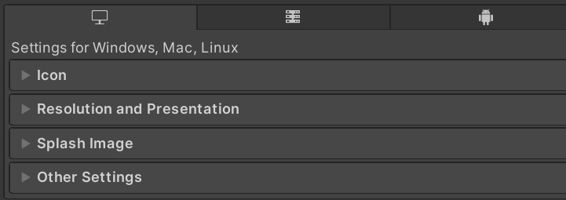
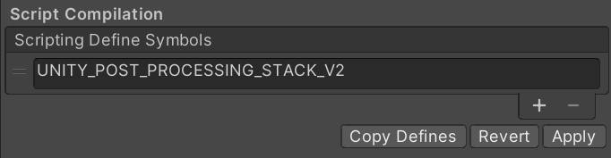

# 
Disabling the EOS plugin on specific platforms

---

## Why disable the plugin?

The plugin provides a certain amount of automatic functionality to support the operation of the EOS SDK, such as DLL loading and post-processing of builds to include the requisite files. Since some of this functionality is not under the user's direct control, the plugin supports a per-platform method of disabling all significant EOS runtime functionality.

## How to disable

1) Open the Player menu in Project Settings:
  
      

2) Select the desired platform and expand the Other Settings submenu:
  
      

3) Find the Scripting Define Symbols configuration:
  
      

4) Use the `+` button to add the `EOS_DISABLE` define to the list and click `Apply`:

      

## Effects of EOS_DISABLE

  - All scripts from the C# EOS SDK included in the `EOS_SDK` subdirectory of the plugin are disabled.
  - All scripts included in the EOS plugin samples are disabled, with except for `EOSHostManager`.
  - Build script functionality (any classes implementing `IPreprocessBuildWithReport` or the like) are disabled.
  - `EOSManager` remains a valid component, but all of its functionality is disabled.

  > [!NOTE]
  > Currently, while doing the above _does_ disable functionality, the Dll may still be loaded.
