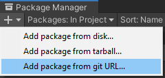
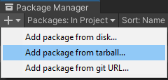
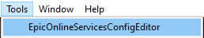
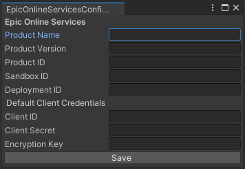
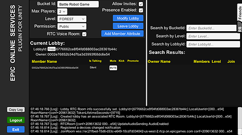
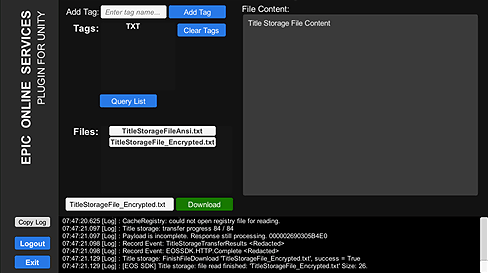
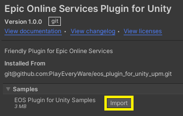
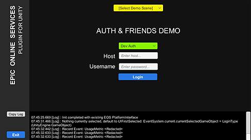
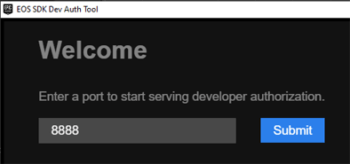

# Epic Online Services Plugin for Unity (UPM package)

## Overview
The [eos_plugin_for_unity_upm repository](https://github.com/PlayEveryWare/eos_plugin_for_unity_upm) contains a Unity Package Manager (UPM) plugin for enabling the use of the [Epic Online Services (EOS)](https://dev.epicgames.com/docs/services/en-US/GameServices/Overview/index.html) [C# SDK](https://dev.epicgames.com/docs/services/en-US/GameServices/CSharpGettingStarted/index.html) in Unity.

For [support issues](https://github.com/PlayEveryWare/eos_plugin_for_unity/issues) or contributing to this open source project, head over to the [source repository](https://github.com/PlayEveryWare/eos_plugin_for_unity).

## Highlights
* Unity GUI tool for configuring EOS product settings, saved out to a JSON file.
* Unity editor playback support, handled by reloading the EOS SDK on the fly.
* Easy to use manager classes that handle common EOS API use-cases.
* Straightforward sample Unity scene templates to get you started.
* EOS Social Overlay support.
* Includes [EOS SDK 1.15.4](https://dev.epicgames.com/docs/epic-online-services/whats-new#1154---2022-nov-16).
* Targets [Unity 2021.3.8f1](https://unity.com/releases/editor/whats-new/2021.3.8).


## Supported Platforms
The follow target platforms are supported in Unity for the current release of the EOS Unity Plugin.

| Unity Target Platform | Current Plugin Release |
| - | - |
| Unity Editor | Supported (No Social Overlay) |
| Windows Standalone x64 | Supported |
| Windows Standalone x86 | Supported |
| Universal Windows Platform x64 | Supported |
| Android | Supported (No Social Overlay) |
| iOS | Supported (No Social Overlay) |
| Linux | Supported (No Social Overlay) |
| MacOS | Supported (No Social Overlay) |
| Console Platforms | Future |
| WebGL | Not Supported |
| Universal Windows Platform x86 | Not Supported |
| Unity Web Player | Not Supported |


## Supported EOS SDK Features
As the EOS SDK continues releasing new features and functionality, the EOS Unity Plugin will be updated over time to support the new functionality. Here's the current list of EOS SDK features and their level of support in the EOS Unity Plugin:

| EOS SDK Feature | Included in Sample |
| - | - |
| [Achievements](https://dev.epicgames.com/docs/services/en-US/GameServices/Achievements/index.html) | Achievements Sample |
| [Authentication](https://dev.epicgames.com/docs/services/en-US/EpicAccountServices/AuthInterface/index.html) | - All Samples - |
| [Ecommerce](https://dev.epicgames.com/docs/services/en-US/EpicGamesStore/TechFeaturesConfig/Ecom/index.html) | Store Sample |
| [Friends](https://dev.epicgames.com/docs/services/en-US/EpicAccountServices/Friends/index.html) | Auth & Friends Sample |
| [Leaderboards](https://dev.epicgames.com/docs/services/en-US/GameServices/Leaderboards/index.html) | Leaderboards Sample |
| [Lobby](https://dev.epicgames.com/docs/services/en-US/GameServices/Lobbies/index.html) | Lobbies Sample |
| [Lobby with Voice](https://dev.epicgames.com/docs/services/en-US/GameServices/Voice/index.html#voicewithlobbies) | Lobbies Sample |
| [NAT P2P](https://dev.epicgames.com/docs/services/en-US/GameServices/P2P/index.html) | P2P Sample |
| [Player Data Storage](https://dev.epicgames.com/docs/services/en-US/GameServices/PlayerDataStorage/index.html) | Player Data Storage Sample |
| [Presence](https://dev.epicgames.com/docs/services/en-US/EpicAccountServices/Presence/index.html) | Auth & Friends Sample |
| [Sessions](https://dev.epicgames.com/docs/services/en-US/GameServices/Sessions/index.html) | Sessions Sample |
| [Social Overlay](https://dev.epicgames.com/docs/services/en-US/EpicAccountServices/SocialOverlayOverview/index.html) | - All Samples - |
| [Stats](https://dev.epicgames.com/docs/services/en-US/GameServices/Stats/index.html) | Leaderboards Sample |
| [Title Storage](https://dev.epicgames.com/docs/services/en-US/GameServices/TitleStorage/index.html) | Title Storage Sample |
| [Reports](https://dev.epicgames.com/docs/services/en-US/GameServices/ReportsInterface/index.html) | Player Reports & Sanctions Sample |
| [Sanctions](https://dev.epicgames.com/docs/services/en-US/GameServices/SanctionsInterface/index.html) | Player Reports & Sanctions Sample |
| [Anti-Cheat](https://dev.epicgames.com/docs/services/en-US/GameServices/AntiCheat/index.html) | Not Supported |
| [EOS Mod SDK](https://dev.epicgames.com/docs/services/en-US/EpicGamesStore/TechFeaturesConfig/Mods/index.html) | Future |
| [Voice Trusted Server](https://dev.epicgames.com/docs/services/en-US/GameServices/Voice/index.html#voicewithatrustedserverapplication) | Not Supported |


---
# Integration Notes
For best results, Unity 2021.3.8 is preferred.


## Installing from a git URL
Ensure you have property setup Unity for [Git Dependency](https://docs.unity3d.com/Manual/upm-git.html).
1. Make sure you have git and git-lfs installed.
2. Open the Unity Editor.
3. Open the Package Manager.
    * It's listed under ```Window -> Package Manager```.
4. Click the ```+``` button.
5. Select '```Add Package from Git URL```'.

    

6. Paste in ```git@github.com:PlayEveryWare/eos_plugin_for_unity_upm.git```
   or ```https://github.com/PlayEveryWare/eos_plugin_for_unity_upm.git```.


## Installing from a tarball
Download the latest release tarball from https://github.com/PlayEveryWare/eos_plugin_for_unity/releases
1. From the Unity Editor, open the Package Manager.
    * It's listed under ```Window -> Package Manager```.
2. Click the ```+``` button.
3. Select '```Add package from tarball```'.

    

4. Go to directory containing the EOS Unity Plugin tarball, and select it.
5. Click ```Open```.


---
# Configuring the Plugin

In order for your Unity project to use EOS, the plugin must first know a few things about it...

## Prerequisites
* A Unity project to integrate the EOS Unity Plugin into.
* An Epic Games Account, which you may sign up for [here](https://dev.epicgames.com/portal/).
* Accepted Terms of Service for [Epic Online Services](https://www.epicgames.com/site/en-US/tos?lang=en-US).
* An EOS Product config, set up in your [Epic Games Developer Portal](https://dev.epicgames.com/portal/).

## Steps
1) Open your Unity project with the integrated EOS Unity Plugin. 
2) In the Unity editor, Open ```Tools -> EpicOnlineServicesConfigEditor```.

    

3) Configure the EOS Unity Plugin.

    

4) From the [developer portal](https://dev.epicgames.com/portal/), copy the configuration values listed below, and paste them into the similarly named fields in the editor tool:
    * ProductName
    * ProductVersion
    * [ProductID](https://dev.epicgames.com/docs/services/en-US/Glossary/index.html#D?term=ProductId)
    * [SandboxID](https://dev.epicgames.com/docs/services/en-US/Glossary/index.html#D?term=SandboxId)
    * [DeploymentID](https://dev.epicgames.com/docs/services/en-US/Glossary/index.html#D?term=DeploymentId)
    * [ClientSecret](https://dev.epicgames.com/docs/services/en-US/Glossary/index.html#D?term=ClientSecret)
    * [ClientID](https://dev.epicgames.com/docs/services/en-US/Glossary/index.html#D?term=ClientId)
    * EncryptionKey
   
At this point, you are ready to start developing using the Epic Online Services Plugin for Unity! Simply attach <code>EOSManager.cs (Script)</code> to a Unity object and it will intialize the plugin with the specified configuration in <code>OnAwake()</code>.

If you would like to see specific examples of various EOS features in action, import the sample Unity scenes below.


---
# Samples

The included samples show fully functional feature implemenation that will both help with EOS integration as well as validate client to dev portal configuration. After installing the samples from the UPM package, you will find scenes for each major feature.




In addition, the samples include Unity friendly *feature* Managers that can help to quickly integrate new EOS features into your title. They provide functional usage of the main feature functionality and can be a good base template.

## Installing the samples
To use the samples, install them from the UPM manager.



The samples include both usage of the EOS SDK, and convience wrappers to make using the SDK more ergonomic in the Unity game engine. By being samples in the UPM sense, they are placed under Assets which allows modification.

## Running the samples
* Launch Unity project with the samples installed.

* In the Unity editor, hit ```Play```.

* Login with a selected authentication type.

    


---
# Authentication

## Running and Configuring the EOS SDK Dev Auth Tool
* Launch the [Developer Authentication Tool](https://dev.epicgames.com/docs/services/en-US/EpicAccountServices/DeveloperAuthenticationTool/index.html)

    

* Pick a port to use on the computer. 8888 is a good quick to type number that isn't usually used by a process.
* Log in with one's user credentials that are registered with Epic.
* Pick a username. This username will be used in the sample to log in.

More specific and up-to-date instructions can also be found on Epic's [website](https://dev.epicgames.com/docs/services/en-US/EpicAccountServices/DeveloperAuthenticationTool/index.html).


---
# Open Source: Contribute

This is an Open Source project. If you would like to view and contribute to the development of the EOS Unity Plugin, you can enlist in the development repo located at
https://github.com/PlayEveryWare/eos_plugin_for_unity


---
# Plugin Support

EOS Plugin for Unity API Documentation can be found at https://eospluginforunity.playeveryware.com

For issues related to integration or usage of the Unity plugin, please create a ```New Issue``` under the [Issues](https://github.com/PlayEveryWare/eos_plugin_for_unity/issues) tab of the [main repo](https://github.com/PlayEveryWare/eos_plugin_for_unity).

For issues related to Epic Online Services SDK, Epic Dev Portal or general EOS SDK information, please go to [Epic Online Services Community Support](https://eoshelp.epicgames.com/).

Detailed descriptions and usage for EOS SDK Interfaces, can be found at [EOS Developer Documentation: Game Services](https://dev.epicgames.com/docs/services/en-US/GameServices/index.html).

