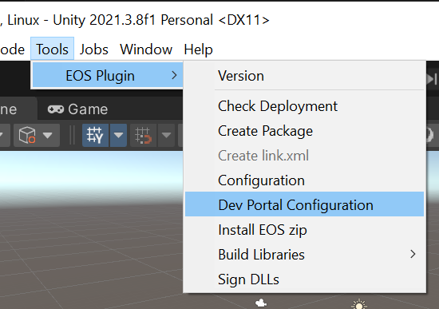
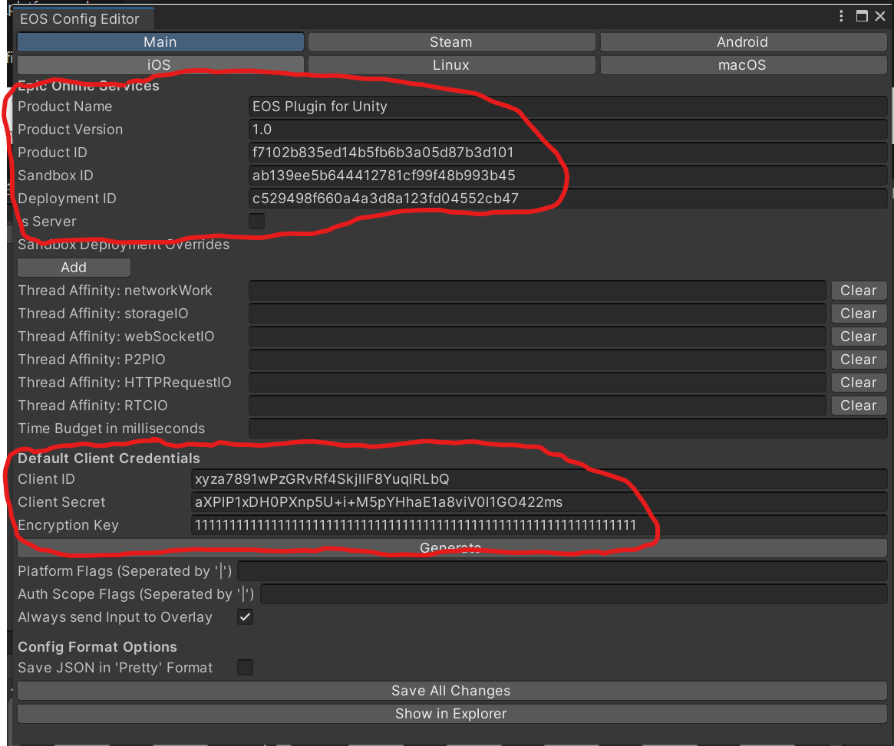

# How to configure the plugin

To get the EOS Plugin for Unity working, the plugin needs to know some specific things about your EOS project.

## Prerequisites
* Unity project to add the plugin to.
* Epic Games Account, which you may sign up for [here](https://dev.epicgames.com/portal/)
* Project registered and added to the [Epic Games Developer Portal](https://dev.epicgames.com/portal/)

## Steps

1. Open the Dev Portal Configuration window for the EOS Plugin (`Tools -> EOS Plugin -> Dev Portal Configuration`)
    
    

2. To configure the plugin, use the EOS Plugin Dev Portal Configuration tool to copy the following properties from the developer portal for your game:

    * ProductName
    * ProductVersion
    * [ProductID](https://dev.epicgames.com/docs/services/en-US/Glossary/index.html#P?term=ProductId)
    * [SandboxID](https://dev.epicgames.com/docs/services/en-US/Glossary/index.html#S?term=SandboxId)
    * [DeploymentID](https://dev.epicgames.com/docs/services/en-US/Glossary/index.html#D?term=DeploymentId)
    * [ClientSecret](https://dev.epicgames.com/docs/services/en-US/Glossary/index.html#C?term=OAuth%20ClientSecret)
    * [ClientID](https://dev.epicgames.com/docs/services/en-US/Glossary/index.html#C?term=OAuth%20ClientId)
    * EncryptionKey

    

