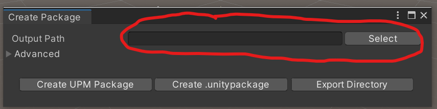

# 
Creating a UPM package

---

## Overview
This tool (while a bit rough around the edges) allows for the generation of custom UPM packages of various components of the project.

## Steps to generate a UPM package

1. Go to `Tools -> EOS Plugin -> Create Package`.

    

2. Select an output path for the package.

    

3. Select button for the package you want to create:
    - "Create UPM Package" will create a tarball `.tgz` file in the output directory indicated that contains the plugin.
    - "Create .unitypackage" will create a `.unitypackage` file containing the plugin.
    - "Export to Directory" will do the same as "Create UPM Package," but will not compress the output, so you'll get a directory of the exported files.

> [!IMPORTANT]
> If you are familiar with the structure of the package `.json` file format, you can expand the advanced carrot and use a different `.json` for package creation. By default, the json file is `etc/PackageConfigurations/eos_package_description.json`.
