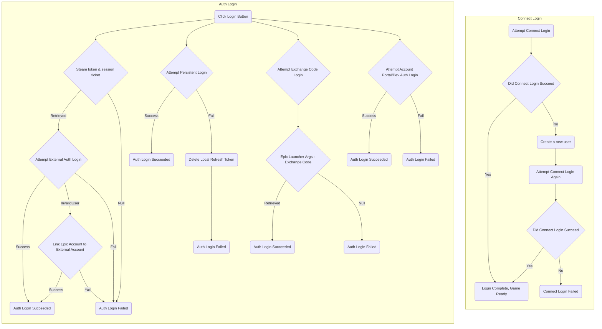

<a href="/README.md"></a>

# Authenticating Players

## Overview

This file documents how Login works in the PlayEveryWare EOS Plugin for the following platforms:
* Windows
* Mac 
* Linux
* iOS
* Android

## Prerequisites

The EOS Platform Interface must be initialized before performing a login. This can be accomplished by attaching `EOSManager.cs` to an object in the scene.

## Login Interfaces

There are two login interfaces:
* **Auth Login**       for authorizing an **Epic Account** and related services 
* **Connect Login**    for connecting the **User** for one **ProductID (Game)**

More information about the distinction can be found [here](https://dev.epicgames.com/en-US/news/accessing-eos-game-services-with-the-connect-interface#a-brief-summary-of-auth-vs-connect-interfaces)

For information on how to authenticate a user via Apple, check out [this](/docs/apple_signin.md) guide.

### Auth Login

* Auth Login functions are declared in EOS Auth Interface
* **Account Portal** (`EOS_LCT_AccountPortal`) and **Persistent Auth** (`EOS_LCT_PersistentAuth`) are the primary Auth Types (`LoginCredentialType`) to login  
  * **Persistent Auth** will login with credentials of the previous successful **Account Portal** login
* **Dev Auth**(`EOS_LCT_Developer`) is for quick iteration for developers, which could be done by using the Dev-Auth tool provided with the EOS SDK. Read [this](https://github.com/PlayEveryWare/eos_plugin_for_unity/tree/development/docs/Walkthrough.md) for details
* **External Auth** is currently only for Steam session ticket login on these platforms
* **Exchange Code** is for logging in on Epic Game Store deployments

A list of which `LoginCredentialType` to use on which platform could be found [here](https://github.com/PlayEveryWare/eos_plugin_for_unity/tree/development/docs/login_type_by_platform.md)

### Connect Login

* Connect Login functions are declared in EOS Connect Interface

----------------------------------------------------------------------------------------
## Login Flow



----------------------------------------------------------------------------------------

## Code Example

Here are examples for each of the `LoginCredentialTypes`

### Persistent Auth

`StartPersistentLogin` attempts a login with `PersistentAuth`, and determine what happens according to the callback result
```cs
public void StartPersistentLogin(OnAuthLoginCallback onLoginCallback)
{
    StartLoginWithLoginTypeAndToken(LoginCredentialType.PersistentAuth, null, null, (callbackInfo) =>
    {
            // Handle invalid or expired tokens for the caller
            switch(callbackInfo.ResultCode) {
                // If the login attempt results in an invalid token, delete the local refresh token
                case Result.AuthInvalidPlatformToken:
                case Result.AuthInvalidRefreshToken:
                    var authInterface = EOSManager.Instance.GetEOSPlatformInterface().GetAuthInterface();
                    var options = new Epic.OnlineServices.Auth.DeletePersistentAuthOptions();
                    authInterface.DeletePersistentAuth(ref options, null, (ref DeletePersistentAuthCallbackInfo deletePersistentAuthCallbackInfo) =>
                    {
                            onLoginCallback?.Invoke(callbackInfo);
                    });
                    return;
                default:
                    break;
            }
            
            onLoginCallback?.Invoke(callbackInfo);
    });
}
```

The `onLoginCallback` in the function above is defined in `OnLoginButtonClick` function, at the `LoginCredentialType.PersistentAuth` case.


```cs
EOSManager.Instance.StartPersistentLogin((Epic.OnlineServices.Auth.LoginCallbackInfo callbackInfo) =>
{
    if (callbackInfo.ResultCode != Epic.OnlineServices.Result.Success) 
    {
        // Pesistent Login Failed, handle the fail case here
        return;
    }
    else 
    {
        // Persistent Login Succeeded
        StartLoginWithLoginTypeAndTokenCallback(callbackInfo);
    }
});
```

### Account Portal & Dev Auth

Unlike `Persistent Auth`, these two `LoginCredentialTypes` do not need to worry about stored token, thus they could attempt login directly.

```cs
EOSManager.Instance.StartLoginWithLoginTypeAndToken(
    loginType,
    usernameAsString, // can be null for Account Portal
    passwordAsString, // can be null for Account Portal
    StartLoginWithLoginTypeAndTokenCallback);
``` 

### Exchange Code

`Exchange Code` login could used when launching the game through Epic Games Launcher on desktop platforms (Windows, Mac, Linux).
The required exchange code could be retrieved with `GetCommandLineArgsFromEpicLauncher()`.

```cs
EOSManager.Instance.StartLoginWithLoginTypeAndToken(
    loginType,
    null, // Intended for UserID, but is unused for Exchange Code login
    // The exchange code itself, passed as login token
    EOSManager.Instance.GetCommandLineArgsFromEpicLauncher().authPassword, 
    StartLoginWithLoginTypeAndTokenCallback);
``` 

### External Auth

Currently `External Auth` is for Steam session ticket login.

```cs
public void StartLoginWithSteam(EOSManager.OnAuthLoginCallback onLoginCallback)
{
    string steamId = GetSteamID();
    string steamToken = GetSessionTicket();
    if (steamId == null || steamToken == null)
    {
        // Persistent Login Failed, handle the fail case here
        return;
    }
    else
    {
        EOSManager.Instance.StartLoginWithLoginTypeAndToken(
            Epic.OnlineServices.Auth.LoginCredentialType.ExternalAuth,
            Epic.OnlineServices.ExternalCredentialType.SteamSessionTicket,
            steamId,
            steamToken,
            onLoginCallback);
    }
}
```           
### Handling Auth Login Results

When an Auth Login attempt finishes, `StartLoginWithLoginTypeAndTokenCallback` gets called and handles the login flow according to the result from Auth Login.  
* Auth Login returned `Success`: Login flow proceeds to perform a Connect Login attempt.
* Auth Login returned `InvalidUser`: Implies that Steam(`External Auth`) logged in successfully but Epic Account wasn't linked yet, login flow prompts the user to link one.

```cs
public void StartLoginWithLoginTypeAndTokenCallback(LoginCallbackInfo loginCallbackInfo)
{
    // Epic Account logged in successfully
    if (loginCallbackInfo.ResultCode == Epic.OnlineServices.Result.Success)
    {
        // Proceed to Connect Login
        StartConnectLoginWithLoginCallbackInfo(loginCallbackInfo);
    }
    
    // If no Epic Account is linked to Steam account yet
    else if (loginCallbackInfo.ResultCode == Epic.OnlineServices.Result.InvalidUser)
    {
        // Prompts the user to link an Epic account to the Steam account, 
        // whether by creating a new one or linking an existing one
        EOSManager.Instance.AuthLinkExternalAccountWithContinuanceToken(
            loginCallbackInfo.ContinuanceToken, 
            LinkAccountFlags.NoFlags,
            (Epic.OnlineServices.Auth.LinkAccountCallbackInfo linkAccountCallbackInfo) =>
        {
            
            if (linkAccountCallbackInfo.ResultCode == Result.Success)
            {
                // Proceed to Connect Login
                StartConnectLoginWithLoginCallbackInfo(loginCallbackInfo);
            }
            else
            {
                // Epic Account wasn't linked
                return;
            } 
            return;
        });
    }
    else 
    {
        // Other fail cases of the external login attempt
        return; 
    }
}
```

### Connect Login

When Auth Login Succeeds, Connect login gets called next. 

```cs    
private void StartConnectLoginWithLoginCallbackInfo(LoginCallbackInfo loginCallbackInfo)
{
    // Attempts Connect Login
    EOSManager.Instance.StartConnectLoginWithEpicAccount(
        loginCallbackInfo.LocalUserId, 
        (Epic.OnlineServices.Connect.LoginCallbackInfo connectLoginCallbackInfo) =>
    {
        if (connectLoginCallbackInfo.ResultCode == Result.Success)
        {
            // Login flow completed and succeeded
        }
        
        // There is no user created for this game on this Epic Account yet
        else if (connectLoginCallbackInfo.ResultCode == Result.InvalidUser)
        {
            // Ask user if they want to connect; sample assumes they do and creates an user
            EOSManager.Instance.CreateConnectUserWithContinuanceToken(
                connectLoginCallbackInfo.ContinuanceToken, 
                (Epic.OnlineServices.Connect.CreateUserCallbackInfo createUserCallbackInfo) =>
                {
                    // Attempts Connect Login again after user created for the account
                    EOSManager.Instance.StartConnectLoginWithEpicAccount(
                        loginCallbackInfo.LocalUserId, 
                        (Epic.OnlineServices.Connect.LoginCallbackInfo retryConnectLoginCallbackInfo) =>
                        {
                            if (retryConnectLoginCallbackInfo.ResultCode == Result.Success)
                            {
                                // Login flow completed and succeeded
                            }
                        });
                });
        }
    });
}
```      
> [!WARNING]
> What happens after login should be tailored to fit the game's flow, such as configure UI, open main scene, log information, etc.
> They are omitted to keep this file concise. The full version of the functions could be found in plugin scripts `EOSManager.cs` and `UILoginMenu.cs`.
            
### Intermediate functions that `StartLoginWithLoginTypeAndToken` contains

  * Sets `ExternalCredentialType.Epic` as the ExternalCredentialType
```cs       
public void StartLoginWithLoginTypeAndToken(
    LoginCredentialType loginType, 
    string id, 
    string token, 
    OnAuthLoginCallback onLoginCallback)
{
    StartLoginWithLoginTypeAndToken(loginType, ExternalCredentialType.Epic, id, token, onLoginCallback);
}
```        
  * Packs parameters into `LoginOptions` as an input for `StartLoginWithLoginOptions` (and eventually `EOSAuthInterface.Login`)
```cs  
public void StartLoginWithLoginTypeAndToken(
    LoginCredentialType loginType, 
    ExternalCredentialType externalCredentialType, 
    string id, 
    string token, 
    OnAuthLoginCallback onLoginCallback)
{
    var loginOptions = MakeLoginOptions(loginType, externalCredentialType, id, token);
    StartLoginWithLoginOptions(loginOptions, onLoginCallback);
}
```       
  * With parameters all set we can finally call `StartLoginWithLoginOptions` function used for all kinds of login
```cs  
public void StartLoginWithLoginOptions(Epic.OnlineServices.Auth.LoginOptions loginOptions, OnAuthLoginCallback onLoginCallback)
{
    var EOSAuthInterface = GetEOSPlatformInterface().GetAuthInterface();
    Assert.IsNotNull(EOSAuthInterface, "EOSAuthInterface was null!");

#if UNITY_IOS && !UNITY_EDITOR
    // App Controller needs to be set in Login Options for iOS
    IOSLoginOptions modifiedLoginOptions = (EOSManagerPlatformSpecifics.Instance as EOSPlatformSpecificsiOS).MakeIOSLoginOptionsFromDefault(loginOptions);
    EOSAuthInterface.Login(
        ref modifiedLoginOptions, null, 
        (Epic.OnlineServices.Auth.OnLoginCallback)((ref Epic.OnlineServices.Auth.LoginCallbackInfo data) => {
#else
    EOSAuthInterface.Login(ref loginOptions, null, (Epic.OnlineServices.Auth.OnLoginCallback)((ref Epic.OnlineServices.Auth.LoginCallbackInfo data) => {
#endif
    // This is the EOS login part
    EOSAuthInterface.Login(ref loginOptions, null, (Epic.OnlineServices.Auth.OnLoginCallback)((ref Epic.OnlineServices.Auth.LoginCallbackInfo data) => {

        if (data.ResultCode == Result.Success)
        {
            loggedInAccountIDs.Add(data.LocalUserId);

            SetLocalUserId(data.LocalUserId);

            ConfigureAuthStatusCallback();

            CallOnAuthLogin(data);
        }

        if (onLoginCallback != null) 
        {
            // Next step will be handled by the callback function, whether login succeeds or not
            onLoginCallback(data);
        }

    }));
}
```
