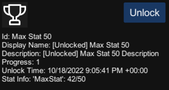

## **Achievements Demo**
This demo showcases the Achievements function. This is done through 2 test achievements, one tracking logins and the other logging an arbitrary stat. Each Achievement has a unlocked and locked display name and description, as well as the ability to hide it and the relevant tracked data for it.
- The ``Show Achievement`` button shows extra debug details for a selected achievement.
- The ``Refresh Data`` button refreshes the achievement data.
- The ``Increase Login Count`` button increases the login counter used for the first achievement.
- The icon labeled 01 is the login count achievement, it can be selected to view its data.
- The icon labeled Max Stat 50 is the stat count achievement, it can be selected to view its data.

- The ``Unlock`` button unlocks the selected achievement, regardless of its current state.

During development, one might test whether a given achievement is functioning.
To make testing easier, one could manually unlock or reset an user's achievement status through the developer portal

1.  Login in to the developer portal, see the tags on the left hand side of the page
    select `[Targeted Game] > Game Services > Achievements`  

    
2.  Go to `Product User Search` and search for the user whose achievement data wanted to be reset *with their `Product User ID`*  
    *Remember to select the correct `Deployment`, as achievement data aren't shared between them*
    
3.  Press Unlock All or Reset All, the users achievement should be set accordingly.

*This only modifies whether an user has an achievement unlocked.*  
*If one wants to modify the stat that unlocks the achievement (ex. Login Count)*  
*Go to `[Targeted Game] > Game Services > Stats` instead, the remaining steps are similar*

> [!NOTE]
> More information on the Achievement interface can be found [here](https://dev.epicgames.com/docs/game-services/achievements).