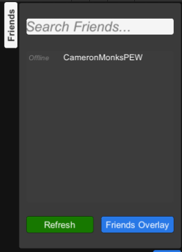

## **Auth & Friends Demo**
This demo showcases an implementation of the friends list into a game UI. The panel on the right shows the user's friend list and status of each friend. This panel can be accessed in other scenes that require access to the friends list.
- The ``Refresh`` button refreshes the list, repolling for information.
- The ``Friends Overlay`` button opens the EOS overlay.
- The Friends tab, on the top left of the friends list, opens and closes the friends list. **In other samples it may start closed or may not be present where appropriate**

> [!NOTE]
> More documentation on the Auth and Friends interface can be found [here](https://dev.epicgames.com/docs/epic-account-services/auth), with more specific information on the friends interface [here](https://dev.epicgames.com/docs/epic-account-services/eos-friends-interface).
