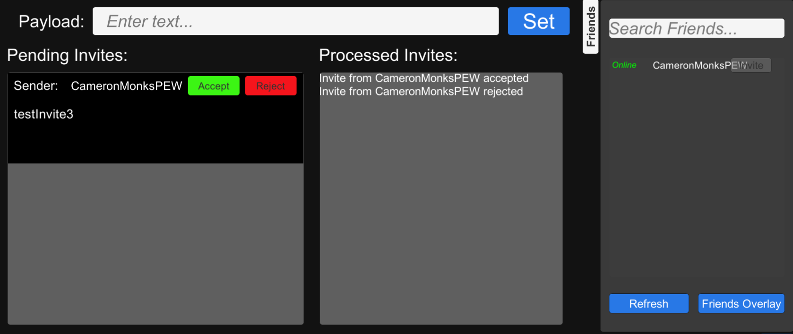

## **Custom Invites Demo**
This demo showcases the custom invite functionality allowing for messaging with arbitrary payloads. This is meant for cases where an already existing invitation system exists. This demo allows users to send invites with a text payload to anyone on their friends list.
- The ``Payload`` field is where the text payload should be input.
- The ``Set`` button finalizes the invitation creation allowing for it to be sent.
- The ``Invite`` button next to any name on the friends list sends an invitation to that user **only if an invitation has been set**.
- The ``Pending Invite`` window will display any incoming invitations, with an ``Accept`` or ``Reject`` option.
- The ``Processed Invites`` window shows all processed invites for the current login period, and if they were accepted or rejected.

> [!NOTE] 
> More documentation on the Custom Invites interface can be found [here](https://dev.epicgames.com/docs/game-services/custom-invites-interface).