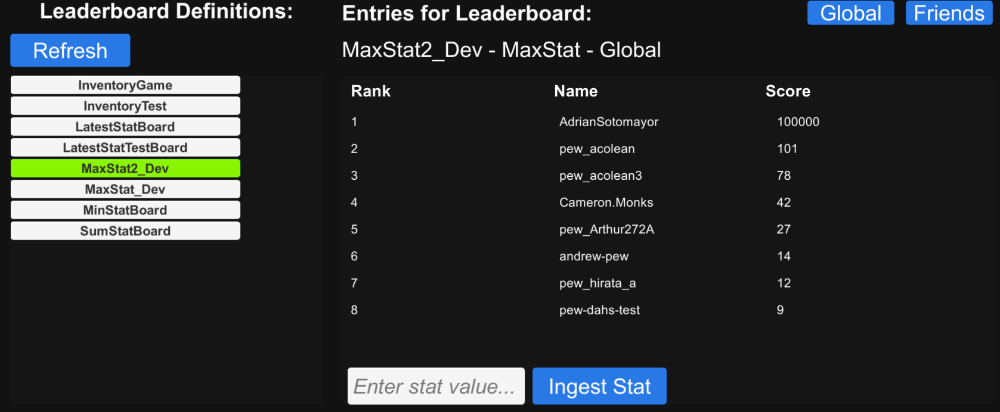

## **Leaderboards Demo**
This demo showcases the leaderboard functionality to track scores across the player base with multiple filter methods such as global scores or only friend scores.
- The left side of the demo shows all the established leaderboards for the product, clicking one will display the leaderboard on the right window.
- The ``Refresh`` button in the top left of the demo refreshes the available list of leaderboards.
- The right window with `` Rank`` ``Name `` and `` Score`` is a test leaderboard that shows the rank, player name, and relevant score for the selected leaderboard.
- The ``Global`` and `` Friends`` button in the top right toggle between showing global statistics and only friend statistics respectively.
- The ``Enter stat value`` box is used to add a stat from the currently logged in account to the currently selected leaderboard through the ``Ingest Stat`` button.

> [!NOTE]
> More documentation on the Leaderboard interface can be found [here](https://dev.epicgames.com/docs/game-services/leaderboards).