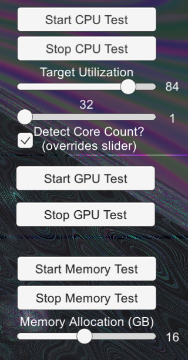

<a href="/README.md"></a>

## **Performance Stress Test**
This scene was created to test the performance of the overlay under different system conditions, it does not use any EOS systems outside of the overlay. It has the ability to change cpu usage, gpu usage, and memory usage.
- CPU Test
    - The ``Start CPU Test`` and ``Stop CPU Test`` start and stop the cpu usage tests respectively, the test targets the specified number of cores at the specified usage.
    - The ``Target Utilization Slider`` sets the target utilization of the cpu as a percentage.
    - The bottom slider in the CPU section sets the number of cores to use in the test.
    - The ``Detect Core Count`` overrides the number of cores used in the test to be all cores on the current system.
- GPU Test
    - The ``Start GPU Test`` and ``Stop GPU Test`` start and stop the gpu usage tests respectively. This test does not have a target utilization, but rather renders a complex scene which should use most if not all of a graphics card's computational bandwidth.
- Memory Test
    - The ``Start Memory Test`` and ``Stop Memory Test`` start and stop the memory usage tests respectively.
    - The ```Memory Allocation``` Slider determines how much memory to allocate for the test (Due to how Unity handles memory, this memory is not returned to the system until the program is closed, however ending the test returns it to Unity's memory manager).

    

The Perfomance Stress Test Sample Scene is included in the `Extra Pack 2` sample pack.  

Upon import, the `com.unity.postprocessing` package that this scene requires will be automatically installed.  You will still need to <a href="/README.md#importing-samples">add it in the build settings</a>.