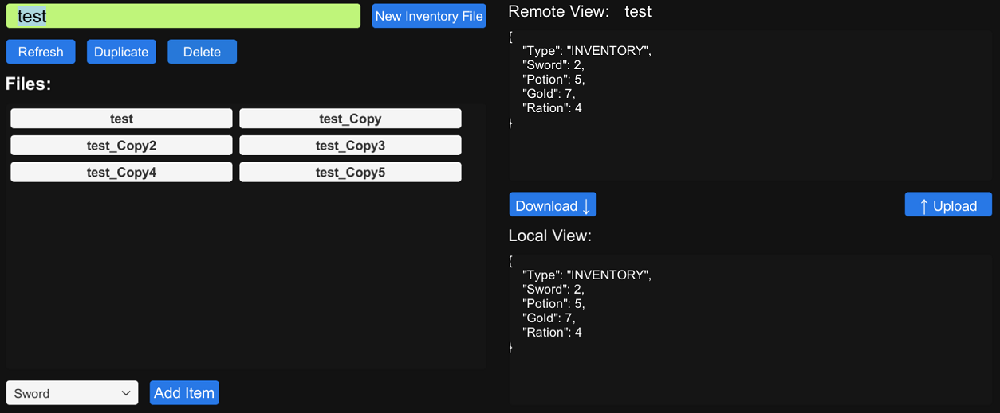

## **Player Data Storage Demo**
This demo showcases the Player Data Storage interface. This allows games to store player specific data in cloud servers. The demo uses a faux inventory to showcase this.
- The ``Enter filename`` box is used to enter a filename to be created locally.
- The ``New Inventory File`` creates an inventory file with the specified name in the cloud.
- The ``Refresh``, ``Duplicate``, and ``Delete`` buttons all do their respective action to the selected file in the window below.
- The ``Files:`` window displays inventory files in the cloud, selecting one will display its details in the ``Remote View`` window.
- The ``Download`` button downloads the currently selected file to the disk.
- The ``Add Item`` add the item from the dropdown to the current local inventory.
- The ``Upload`` button uploads the current local inventory file to the cloud, overwriting the old version.

> [!NOTE] 
> More documentation on the Player Data Storage interface can be found [here](https://dev.epicgames.com/docs/game-services/player-data-storage).