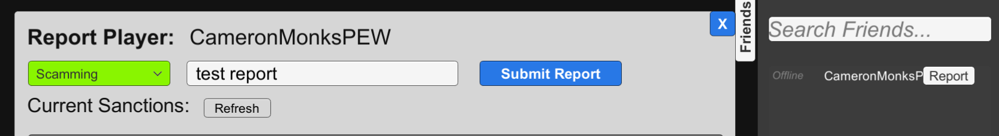

## **Player Reports and Sanctions Demo**
This demo showcases the reports interface and sanctions interface. This is done through a report menu, and a display of any current sanctions on the user's account.
- The friends tab on the right of the screen allows the user to open a report window with the ``Report`` button.
    - The report window has a dropdown to select the offense.
    - ``Optional Message`` allow the user to include a message with their report.
    - The ``Submit Report`` button sends the report.
- The ``Current Sanctions`` section shows any sanctions on the users account.
    - The ``Refresh`` button refreshes the display.
    - Sanctions can be added through the developer portal for the product from the ``Game Services -> Sanctions`` menu, where sanctions can be added, removed, updated and pending sanctions can be activated.

> [!NOTE]
> More documentation on the reports interface can be found [here](https://dev.epicgames.com/docs/game-services/reports-interface), and more documentation on the sanctions interface can be found [here](https://dev.epicgames.com/docs/game-services/sanctions-interface).