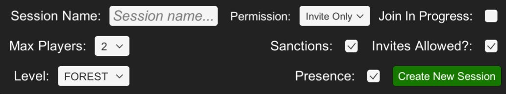

## **Sessions and Matchmaking**
This demo showcases the sessions interface, users can create, manage and join sessions.
- The top left window allows users to create and manage their sessions.
    - The ``Session Name`` field is where users set the name of their session.
    - The ``Max Players`` dropdown selects the maximum number of players that can connect to the session.
    - The ``Level`` dropdown selects the level of the session.
    - The ``Permission`` dropdown selects the join permissions of the session.
        - ``Invite Only`` only allows players who have received an invite from someone already in the session.
        - ``Join via Presence`` allows players to join through the [presence](https://dev.epicgames.com/docs/epic-account-services/eos-presence-interface) system.
        - ``Public`` allows anyone to search for and join the session.
        - ``Join in progress`` toggles whether or not players can join a session after it has started.
        - ``Sanctions`` toggles whether or not [sanctions](https://dev.epicgames.com/docs/game-services/sanctions-interface) are enforced.
        - ``Invites Allowed?`` toggles whether or not players in a session can invite others to join
        - ``Presence`` toggles whether or not to use the [presence](https://dev.epicgames.com/docs/epic-account-services/eos-presence-interface) system.
        - ``Create New Session`` creates and joins a new session with the set configuration.

        

    - The ``Current Sessions`` Window shows current sessions with their relevant information.
        - ``Name`` the the session's name.
        - ``Status`` the status of the session, ``Pending``, ``In Progress``, or ``Ended``.
        - ``Players`` shows the current number and maximum connected users.
        - ``Level`` shows the session's selected level.
        - ``JIP`` shows whether or not join in progress is enabled.
        - ``Permission`` shows which join permission setting was used.
        - ``Invites`` shows whether or not invites are allowed.
        - The ``Start`` button changes the status of the session to ``In Progress``.
        - The ``End`` button changes the status of an ``In Progress`` session to ``Ended``.
        - The ``Modify`` button updates the session setting to the current selection.
        - The ``Leave`` button leaves the session.
    - The ``Search Level`` field allows users to search current sessions by level.

> [!NOTE]
> More documentation on the sessions interface can be found [here](https://dev.epicgames.com/docs/game-services/sessions).